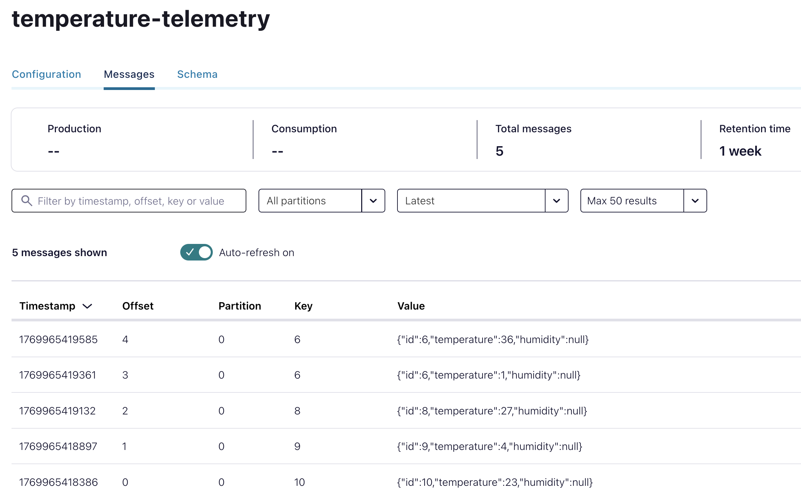
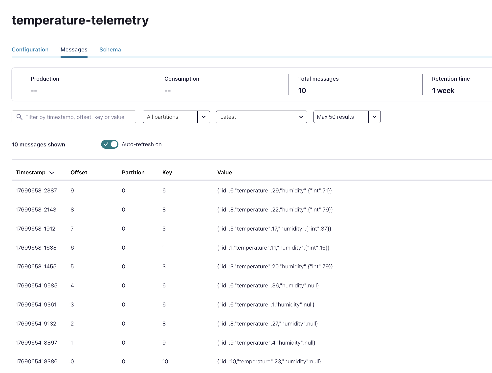
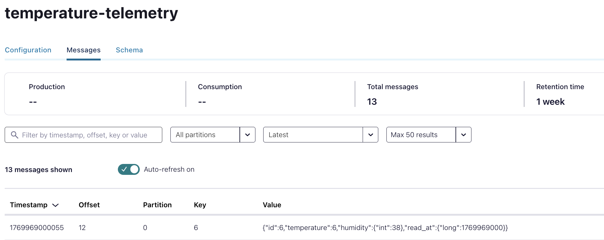

# Schema Registry

En este ejercicio vamos a explorar la funcionalidad que aporta Confluent Schema Registry

Primeramente exploraremos el API REST, y una vez entendamos cómo funcionan las diferentes llamadas a la API REST, haremos uso de un plugin Maven junto con algún ejemplo para ver la serialización en acción.

## REST API

[API REST](https://docs.confluent.io/platform/current/schema-registry/develop/api.html)

Tal y como venimos haciendo, utilizaremos los comandos `curl` y `jq` en una terminal.

### Listar subjects

```bash
curl -s "http://localhost:8081/subjects" | jq
```

Al ejecutar este comando según iniciamos el entorno, no debería haber ningún schema configurado

```
[]
```

### Modo de compatibilidad por defecto

```bash
curl -s "http://localhost:8081/config" | jq
```

Podemos ver que por defecto el modo de compatibilidad para cualquier subject será **BACKWARDS**

```json
{
  "compatibilityLevel": "BACKWARD"
}

```

### Registrar un schema

Los schemas Avro se definen en formato JSON. Podéis consultar la especificación [aquí](https://avro.apache.org/docs/current/specification/). 

En este paso vamos a registrar el siguiente schema:  


Algunos de los campos importantes del schema son:

- **namespace** : espacio de nombres que identifica unívocamente al tipo/clase. En el código generado para el lenguaje Java será el paquete
- **name** : nombre del tipo/clase. En el código generado para el lenguaje Java será la clase
- **fields** : lista de campos
- **doc**: documentación sobre el elemento en cuestión:
- **type**: tipo de datos. Avro admite tipos simples y tipos complejos

```bash
jq '. | {schema: tojson}' ./src/main/avro/com.ucmmaster.kafka.data.v1.TemperatureTelemetry.avsc | curl -s -X POST -H "Content-Type: application/vnd.schemaregistry.v1+json" http://localhost:8081/subjects/temperature-telemetry-value/versions  -d @- | jq 
 ```

Obtendremos una respuesta como esta:

```json
{
  "id": 1
}
```
La respuesta de la solicitud POST es el ID que Schema Registry asignó al nuevo esquema. 

Schema Registry asigna un ID único (un número que aumenta de forma monótona y secuencial) a cada esquema agregado. 

Antes de continuar con otro endpoint, quiero destacar la parte de la URL relativa a subjects/temperature-telemetry-value/, que especifica el nombre del **subject** para el esquema. En este caso estamos siguiendo la estrategia **TopicNameStrategy** en la que el subject se nombre a partir del nombre del topic.

Schema Registry usa el nombre del subject para gestionar el alcance de cualquier cambio/evolución realizado en un esquema.

En este caso, el subject es temperature-telemetry **-value**. Esto quiere decir que los valores de los mensajes producidos en el topic **temperature-telemetry** deben seguir dicha estructura. 

Los subjects tienen un papel relevante en la gestión de cambios admitidos sobre un schema

### Listar subjects

```bash
curl -s "http://localhost:8081/subjects" | jq
```

Obtendremos una respuesta como esta:

```json
[
  "temperature-telemetry-value"
]
```

Verifiquemos el modo de compatibilidad

```bash
curl -s "http://localhost:8081/config/temperature-telemetry-value" | jq
```
```json
{
  "error_code": 40408,
  "message": "Subject 'temperature-telemetry-value' does not have subject-level compatibility configured"
}
```
Vamos a forzar el modo BACKWARDS

```bash
curl -X PUT -H "Content-Type: application/json" --data '{"compatibility": "backward"}' http://localhost:8081/config/temperature-telemetry-value
```

```json
{"compatibility":"backward"}
```

### Listar todas las versiones de un subject

```bash
curl -s "http://localhost:8081/subjects/temperature-telemetry-value/versions" | jq
```
Actualmente sólamente existe un schemas. Obtendremos una respuesta como esta:

```json
[
1
]
```

### Recuperar una versión concreta de schema de un subject

```bash
curl -s "http://localhost:8081/subjects/temperature-telemetry-value/versions/1" | jq
```
Obtendremos una respuesta como esta:

```json
{
  "subject": "temperature-telemetry-value",
  "version": 1,
  "id": 1,
  "schema": "{\"type\":\"record\",\"name\":\"TemperatureTelemetry\",\"namespace\":\"com.ucmmaster.kafka.data.v1\",\"doc\":\"This schema describes a temperature telemetry event produced in a device\",\"fields\":[{\"name\":\"id\",\"type\":\"int\",\"doc\":\"Device id\"},{\"name\":\"temperature\",\"type\":\"int\",\"doc\":\"Temperature Celsius\"}]}"
}
```
El valor del campo **schema** está formateado como un string, por lo que las comillas están escapadas y se eliminan todos los caracteres de nueva línea.

### Recuperar la última versión de un subject

```bash
curl -s "http://localhost:8081/subjects/temperature-telemetry-value/versions/latest" | jq
```

```json
{
"subject": "temperature-telemetry-value",
"version": 1,
"id": 1,
"schema": "{\"type\":\"record\",\"name\":\"TemperatureTelemetry\",\"namespace\":\"com.ucmmaster.kafka.data.v1\",\"doc\":\"This schema describes a temperature telemetry event produced in a device\",\"fields\":[{\"name\":\"id\",\"type\":\"int\",\"doc\":\"Device id\"},{\"name\":\"temperature\",\"type\":\"int\",\"doc\":\"Temperature Celsius\"}]}"
}
```
### Comprobar la compatibilidad de un nuevo schema con la última versión de un subject

En este caso vamos a probar la evolución con el schema v2. En este caso estamos añadiendo un nuevo campo opcional (nullable)
Debería ser un cambio compatible.


Llamamos al endpoint de compatibilidad:

```bash
jq '. | {schema: tojson}' ./src/main/avro/com.ucmmaster.kafka.data.v2.TemperatureTelemetry.avsc | curl -s -X POST -H "Content-Type: application/vnd.schemaregistry.v1+json" "http://localhost:8081/compatibility/subjects/temperature-telemetry-value/versions/latest?verbose=true"  -d @- | jq
```
```json
{
  "is_compatible": true,
  "messages": []
}
```
Efectivamente el cambio es compatible
He creado otra version del schema en la que el campo **humidity** es obligatorio. En este caso este tipo de cambio no está permitido y debería fallar

```bash
jq '. | {schema: tojson}' ./src/main/avro/com.ucmmaster.kafka.data.v2.IncompatibleTemperatureTelemetry.avsc | curl -s -X POST -H "Content-Type: application/vnd.schemaregistry.v1+json" "http://localhost:8081/compatibility/subjects/temperature-telemetry-value/versions/latest?verbose=true"  -d @- | jq 
```

```json
{
  "is_compatible": false,
  "messages": [
    "{errorType:'READER_FIELD_MISSING_DEFAULT_VALUE', description:'The field 'humidity' at path '/fields/2' in the new schema has no default value and is missing in the old schema', additionalInfo:'humidity'}",
    "{oldSchemaVersion: 1}",
    "{oldSchema: '{\"type\":\"record\",\"name\":\"TemperatureTelemetry\",\"namespace\":\"com.ucmmaster.kafka.data.v1\",\"doc\":\"This schema describes a temperature telemetry event produced in a device\",\"fields\":[{\"name\":\"id\",\"type\":\"int\",\"doc\":\"Device id\"},{\"name\":\"temperature\",\"type\":\"int\",\"doc\":\"Temperature Celsius\"}]}'}",
    "{validateFields: 'false', compatibility: 'BACKWARD'}"
  ]
}
```

**IMPORTANTE:** Estas acciones no han registrado el schema en el subject, solamente ha comprobado la potencial compatibilidad

```bash
curl -s "http://localhost:8081/subjects/temperature-telemetry-value/versions/" | jq
```
```json
[
  1
]
```
## MAVEN PLUGIN

En el ámbito del desarrollo java/scala, se utilizan plugins y herramientas de compilación como maven/gradle/sbt para interactuar con Schema Registry.

Generar código a partir del esquema facilita la vida de los desarrolladores, ya que automatiza el proceso repetitivo de crear clases que modelen esos objetos de dominio. 

Además, al mantener los esquemas en un sistema de control de versiones (como git), se reduce significativamente la posibilidad de errores, como definir un campo como string cuando debería ser long etc

Asimismo, cuando se realiza un cambio en un esquema, simplemente se comparte el cambio en el repositorio, y otros desarrolladores pueden actualizar sus dependencias y estar al día de manera rápida y eficiente.

Por favor, revisa la configuración en el fichero pom.xml de este proyecto
 
[Maven Plugin](https://docs.confluent.io/platform/current/schema-registry/develop/maven-plugin.html)

### Comprobar compatibilidad

Vamos a comprobar la compatibilidad BACKWARD de la nueva version del schema


```bash
 mvn clean schema-registry:test-compatibility
```

```bash
[INFO] Scanning for projects...
[INFO] 
[INFO] -------------------< com.ucmmaster:schema-registry >--------------------
[INFO] Building schema-registry 1.0
[INFO]   from pom.xml
[INFO] --------------------------------[ jar ]---------------------------------
[INFO] 
[INFO] --- clean:3.2.0:clean (default-clean) @ schema-registry ---
[INFO] 
[INFO] --- schema-registry:7.8.0:test-compatibility (default-cli) @ schema-registry ---
[INFO] Schema /IdeaProjects/kafka-curso/7.schema_registry/src/main/avro/com.ucmmaster.kafka.data.v2.TemperatureTelemetry.avsc is compatible with subject(temperature-telemetry-value)
[INFO] ------------------------------------------------------------------------
[INFO] BUILD SUCCESS
[INFO] ------------------------------------------------------------------------
[INFO] Total time:  0.486 s
[INFO] ------------------------------------------------------------------------
```

### Registrar nueva version

Vamos a registrar la nueva versión. El plugin se comunica igualmente con el API REST  tal y cómo hicimos al princip

```bash
 mvn clean schema-registry:register
```

```bash
[INFO] Scanning for projects...
[INFO] 
[INFO] -------------------< com.ucmmaster:schema-registry >--------------------
[INFO] Building schema-registry 1.0
[INFO]   from pom.xml
[INFO] --------------------------------[ jar ]---------------------------------
[INFO] 
[INFO] --- clean:3.2.0:clean (default-clean) @ schema-registry ---
[INFO] 
[INFO] --- schema-registry:7.8.0:register (default-cli) @ schema-registry ---
[INFO] Registered subject(temperature-telemetry-value) with id 2 version 2
[INFO] ------------------------------------------------------------------------
[INFO] BUILD SUCCESS
[INFO] ------------------------------------------------------------------------
[INFO] Total time:  0.547 s
[INFO] ------------------------------------------------------------------------
```
**Registered subject(temperature-telemetry-value) with id 2 version 2** 

Nos indica que se ha registrado correctamente y que el identificador interno del schema es el 2


```bash
curl -s "http://localhost:8081/subjects/temperature-telemetry-value/versions/" | jq
```
```json
[
  1,
  2
]
```

## CLIENTES PYTHON

Vamos a ver cómo afecta a los clientes la definición del subject y registros de estos schemas

Primero vamos a crear un virtual env instalando las dependencias necesarias
```bash
cd src/main/python
python -m venv kafka
source kafka/bin/activate
pip install --upgrade pip
pip install -r requirements.txt
```

### PRODUCTOR V1
Lo siguiente será ejecutar el siguiente comando para producir 5 mensajes

```bash
python temperature_telemetry_v1_producer.py
python temperature_telemetry_v1_producer.py
python temperature_telemetry_v1_producer.py
python temperature_telemetry_v1_producer.py
python temperature_telemetry_v1_producer.py
```

Si vamos a control center podemos ver que los mensajes se muestran con el campo humidity a null, a pesar de que el código productor no incluye ese campo.
Este es debido a que la versión actual del subject es la 2 y este campo es nullable y su valor por defecto es null.



### PRODUCTOR V2
Lo siguiente será ejecutar el siguiente comando para producir 5 mensajes

```bash
python temperature_telemetry_v2_producer.py
python temperature_telemetry_v2_producer.py
python temperature_telemetry_v2_producer.py
python temperature_telemetry_v2_producer.py
python temperature_telemetry_v2_producer.py
```

En este caso el valor humidity ya viene informado en el mensaje, al incluirlo el productor



### CONSUMER V1

En el modo de compatibilidad **BACKWARDS** debemos actualizar los consumidores a la ultima version para no perder información de los mensajes producidos en la última versión
Vamos a consumir los mensajes con un consumidor con el schema v1 para que veamos como consumimos mensajes que llevan informado el valor del campo humidity y sin embargo no lo manejamos 

```bash
python temperature_telemetry_v1_consumer.py
```
```bash
Consumiendo mensajes del topic 'temperature-telemetry' con esquema v1...

INFO:httpx:HTTP Request: GET http://localhost:8081/schemas/ids/2?subject=temperature-telemetry-value "HTTP/1.1 200 OK"

→ Mensaje recibido:
   id:         10
   temperatura: 23
------------------------------------------------------------
→ Mensaje recibido:
   id:         9
   temperatura: 4
------------------------------------------------------------
→ Mensaje recibido:
   id:         8
   temperatura: 27
------------------------------------------------------------
→ Mensaje recibido:
   id:         6
   temperatura: 1
------------------------------------------------------------
→ Mensaje recibido:
   id:         6
   temperatura: 36
------------------------------------------------------------
→ Mensaje recibido:
   id:         3
   temperatura: 20
------------------------------------------------------------
→ Mensaje recibido:
   id:         1
   temperatura: 11
------------------------------------------------------------
→ Mensaje recibido:
   id:         3
   temperatura: 17
------------------------------------------------------------
→ Mensaje recibido:
   id:         8
   temperatura: 22
------------------------------------------------------------
→ Mensaje recibido:
   id:         6
   temperatura: 29
------------------------------------------------------------

```
### CONSUMER V2

```bash
python temperature_telemetry_v2_consumer.py
```

```bash
Consumiendo mensajes del topic 'temperature-telemetry' con esquema v2...

INFO:httpx:HTTP Request: GET http://localhost:8081/schemas/ids/2?subject=temperature-telemetry-value "HTTP/1.1 200 OK"
→ Mensaje recibido:
   id:         10
   temperatura: 23
   humidity: None
------------------------------------------------------------
→ Mensaje recibido:
   id:         9
   temperatura: 4
   humidity: None
------------------------------------------------------------
→ Mensaje recibido:
   id:         8
   temperatura: 27
   humidity: None
------------------------------------------------------------
→ Mensaje recibido:
   id:         6
   temperatura: 1
   humidity: None
------------------------------------------------------------
→ Mensaje recibido:
   id:         6
   temperatura: 36
   humidity: None
------------------------------------------------------------
→ Mensaje recibido:
   id:         3
   temperatura: 20
   humidity: 79
------------------------------------------------------------
→ Mensaje recibido:
   id:         1
   temperatura: 11
   humidity: 16
------------------------------------------------------------
→ Mensaje recibido:
   id:         3
   temperatura: 17
   humidity: 37
------------------------------------------------------------
→ Mensaje recibido:
   id:         8
   temperatura: 22
   humidity: 79
------------------------------------------------------------
→ Mensaje recibido:
   id:         6
   temperatura: 29
   humidity: 71
------------------------------------------------------------

```
### PRODUCTOR V3

Vamos a crear una version nueva v3 que añade un campo timestamp a la lectura (read_at)

```bash
python temperature_telemetry_v3_producer.py
```

```bash
...
confluent_kafka.error.ValueSerializationError: KafkaError{code=_VALUE_SERIALIZATION,val=-161,str="Schema not found (HTTP status code 404, SR code 40403)"}
```

En este caso obtenemos un error que nos indica que el schema con el que se intenta producir no existe
Esto es porque tenemos desahabilitado el registro de schemas en tiempo de producción
Vamos al código y vamos a cambiarlo. Esto NO se debe hacer como hemos explicado durante las clases.

```python
value_serializer = AvroSerializer(
    schema_registry_client=schema_registry_client,
    schema_str=schema_str,
    conf={
        'auto.register.schemas': True
    }
)
```

```bash
python temperature_telemetry_v3_producer.py
```

En ese caso ha funcionado la producción y se ha registrado el schema porque era compatible el cambio.




